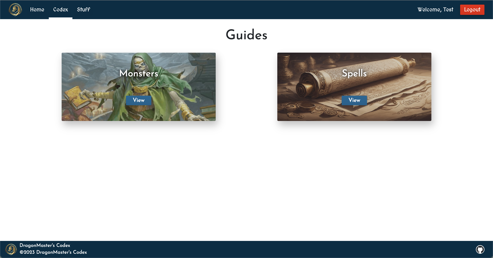

# DragonMasters Codex

>[!NOTE]
>This is a work in progress Dungeons and Dragons app. While there are a lot of files and the app works, it's hardly started. The reason I am showing this at all is because I thought it would be fun if people wanted to watch the development process. I do have a trello board [(View Here)](https://trello.com/invite/b/92gHsvbB/ATTI2b9da9185422a49dd103eab06447d858ABA8FA1F/dragonmaster) of the progress I'm making with a proper build process of the app. What I have currently have is a sloppy, no planning build so I could help my friends understand what I'm trying to build. While trying to explain what the app was for to some friends, I could not get the help I needed with the planning of the most helpful features and design I needed from more experienced players. That's when I threw this together in the spare time I've had over the last couple months. Now that I've had some really good feedback I am starting over the development process to properly document and recreate this amazing app. ***

The goal for DragonMasters Codex is to be a toolbox for DnD players. It has a guide for seeing information on anything the [OGL](https://www.dndbeyond.com/attachments/39j2li89/SRD5.1-CCBY4.0License.pdf)(Wizards of the Coast rules for what data is available and how to use it) allows, and if a user creates an account they can also view their own created content, and each section can be filtered. Once signed in, users also have access to another section of the app. That section is all about the things they have created. Currently, the app only has support for Dungeon Masters(DM), the one running the game. It has a section for encounters. A more detailed breakdown of the sections is further down. Again, to reiterate, this app is to be used while playing the game and will not replace playing the game.

### Why I made it
After playing DnD a few time, the amazing mix of do-what-you-want and simple(ish haha) guidlines completely fascinated me. I was just learning how to code and I thought making a app to practice would be amazing. I ran into a few speedbumps when I was starting to plan something out because the game itself is very complex and has a lot of moving parts, meaning the app would have to be even more so. At the time, I just couldn't feasibly code what I needed to without spending hours which I just didn't have. That's kind of where it ended. I stopped playing for a few years and focused on other things until about a year ago. I met some friends and we started to play DnD. After a long and fun session, someone said something that brought back a wave of memories of my forgotten project. I knew that I had enough practice and knowledge that I could finally get over the speedbumps that had previously stopped me.

## Features
Below are the features currently built into the application. More will be added soon!

### Guides

The Guides section holds a multiple sets of guides that can be viewed. Currently it has monster and spell guides. Select a guide by clicking on it and it will bring the user to a page that shows a list of monsters, spells, etc. that can be filtered with the form on the left. By selecting one of the items will bring up a more detailed popout for that item. There is a button at the top right of the popout to close the page or view in a seperate tab so it can be stored for later reference.

### Stuff

The Stuff section is only accessable for signed in users. If a user isn't signed in or signs out, they will be redirected to the  login page. If a user is signed in, they will be able to view all their created content. Selecting a category will take them to a breakdown of the individual items they've created in that category. Currently, only creating encounters is supported.

### Encounters

The Encounters section has two pieces, viewing existing encounters and creating new encounters. 

By clicking an existing an existing encounter, the user can see the details of the encounter and the players and monsters participating. From there the user can also run the campaign, which will bring up a screen that has a card for each player and monster that is used to track the health of each individual.

The create section is a multi-page form that collects all the details of the new encounter. The first page is general information about the encounter, the second is players to be added, the third is a list of monsters that can be added, and the last page is a review of all added data to ensure it was added correctly.